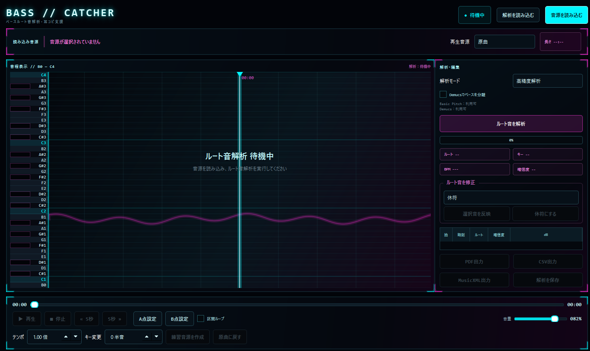

# Bass Catcher

バンドメンバーのベーシストが、楽曲のルート音を耳で拾えず困っていたことをきっかけに開発した、  
**ベースの耳コピを補助するWindowsデスクトップアプリ**です。

音源からベース帯域とルート音候補を解析し、再生位置に合わせて表示します。  
解析結果を正解として確定するのではなく、原曲を聴きながら確認・修正するための手掛かりを増やします。

## 画面



## 主な機能

- MP3 / WAV / FLAC / M4A / AAC / OGGの読み込み
- 再生・一時停止・シーク
- 5秒戻る・5秒進む
- A-B区間ループ
- テンポ・拍位置・キーの推定
- 拍ごとのルート音候補表示
- ルート音の手動修正
- Demucsによるベース分離
- Basic Pitchを使ったAI併用解析
- テンポ・キーを変更した練習用WAVの作成
- PDF / CSV / MusicXML出力
- 解析セッションの保存と再読み込み

## 配布版

Windows向け配布版は、GitHubの **Releases** からダウンロードできます。

1. ZIPファイルを任意の場所へ展開
2. 展開したフォルダ内の `BassCatcher.exe` を起動
3. 「音源を読み込む」から楽曲を選択
4. 解析モードを選択
5. 「ルート音を解析」を実行
6. 原曲を聴きながら候補音を確認・修正

配布版を使用するだけであれば、Pythonのインストールは不要です。

`BassCatcher.exe`だけを別の場所へ移動せず、展開したフォルダごと使用してください。

## 解析モード

| 表示 | 内容 |
| --- | --- |
| 高精度解析 | pYINを中心に使用する標準解析 |
| AI併用解析 | Basic PitchとDSP解析を組み合わせる解析 |
| 高速解析 | 処理速度を優先する簡易解析 |

Demucsが利用できる環境では、原曲からベースを分離して解析できます。

## 開発環境での起動

### 通常版

```powershell
cd "C:\Users\Ryohei\Documents\GitHub\bass-catcher"

& "$env:USERPROFILE\.venvs\bass-catcher\Scripts\Activate.ps1"

.\install.ps1

.\run.ps1
```

### AI機能込み

```powershell
.\install.ps1 -AI

.\run.ps1
```

## Windows EXEの作成

### 通常版

```powershell
.\build_exe.ps1
```

### AI機能込み

```powershell
.\build_exe.ps1 -AI
```

生成先：

```text
dist\BassCatcher\BassCatcher.exe
```

配布時は、`dist\BassCatcher`フォルダの中身をすべてZIPにまとめてください。

## 注意事項

音源のミックス、ベースの音量、歪み、キックとの重なりなどにより、誤認識が発生する場合があります。

解析結果は正解を保証するものではありません。  
演奏前には必ず原曲を再生し、耳で確認してください。

読み込んだ音源を外部サーバーへアップロードする機能はありません。

本アプリは現在開発中の試験版です。

## License

MIT License
